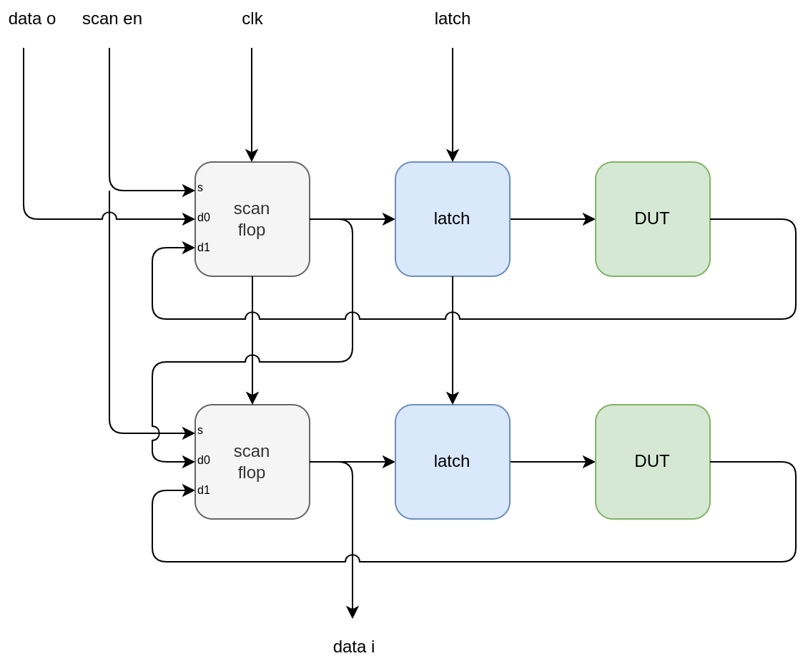
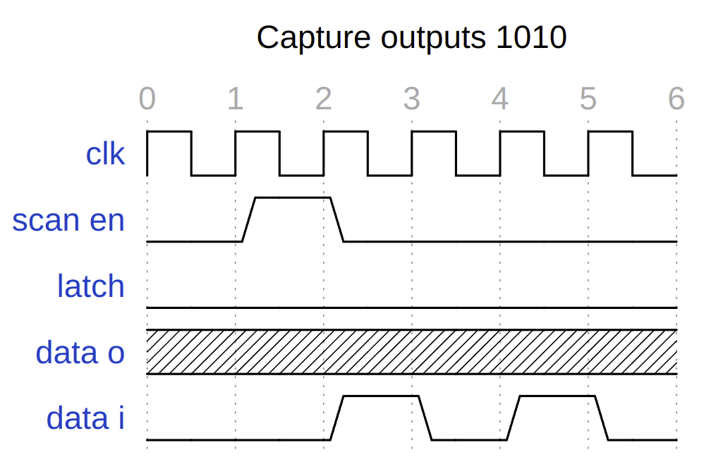

# Technical info

## Clocking

Assuming:

* 100MHz input clock
* 8 ins & 8 outs
* 2 clock cycles to push one bit through the scan chain (scan clock is half input clock rate)
* 500 designs
* scan controller can do a read/write cycle in one refresh

So the max refresh rate is 100MHz / (8 * 2 * 500) = 12500Hz.

## Clock divider

A rising edge on the set_clk_div input will capture what is set on the input pins and use this as a divider for an internal slow clock that can be provided to the first input bit.

The slow clock is only enabled if the set_clk_div is set, and the resulting clock is connected to input0 and also output on the slow_clk pin.

The slow clock is synced with the scan rate. A divider of 0 mean it toggles the input0 every scan. Divider of 1 toggles it every 2 cycles.
So the resultant slow clock frequency is scan_rate / (2 * (N+1)).

See the test_clock_div test in the [scan chain verification](verification.md).

## Wait states

This dictates how many wait cycle we insert in various state
of the load process. We have a sane default, but also allow
override externally.

To override, set the wait amount on the inputs, set the driver_sel inputs both high, and then reset the chip.

See the test_wait_state test in the [scan chain verification](verification.md).

## Pinout

    PIN     NAME                DESCRIPTION
    20:12   active_select       9 bit input to set which design is active
    28:21   inputs              8 inputs
    36:29   outputs             8 outputs
    37      ready               goes high for one cycle everytime the scanchain is refreshed
    10      slow_clk            slow clock from internal clock divider
    11      set_clk_div         enable clock divider
    9:8     driver_sel          which scan chain driver: 00 = external, 01 = logic analyzer, 1x = internal

    21      ext_scan_clk_out    for external driver, clk input
    22      ext_scan_data_out   data input
    23      ext_scan_select     scan select
    24      ext_scan_latch_en   latch
    29      ext_scan_clk_in     clk output from end of chain
    30      ext_scan_data_in    data output from end of chain

## Scan controller configuration

The scan controller allows a configurable delay on the latch and scan select pulses. TODO.

## Scan chain structure

[read wavedrom diagram](https://wavedrom.com/editor.html?%7Bsignal%3A%20%5B%0A%20%20%7Bname%3A%20%27clk%27%2C%20wave%3A%20%27p.....%27%7D%2C%0A%20%20%7Bname%3A%20%27scan%20en%27%2C%20wave%3A%20%27010...%27%7D%2C%0A%20%20%7Bname%3A%20%27latch%27%2C%20wave%3A%20%270.....%27%7D%2C%0A%20%20%7Bname%3A%20%27data%20o%27%2C%20wave%3A%20%27x.....%27%7D%2C%0A%20%20%7Bname%3A%20%27data%20i%27%2C%20wave%3A%20%270.1010%27%7D%2C%0A%5D%2C%0Ahead%3A%7B%0A%20%20%20text%3A%27Capture%20outputs%201010%27%2C%0A%20%20%20tick%3A0%2C%0A%20%20%20every%3A1%0A%20%7D%7D%0A)

[load wavedrom diagram](https://wavedrom.com/editor.html?%7Bsignal%3A%20%5B%0A%20%20%7Bname%3A%20%27clk%27%2C%20wave%3A%20%27p...l.%27%7D%2C%0A%20%20%7Bname%3A%20%27scan%20en%27%2C%20wave%3A%20%270.....%27%7D%2C%0A%20%20%7Bname%3A%20%27latch%27%2C%20wave%3A%20%270...10%27%7D%2C%0A%20%20%7Bname%3A%20%27data%20o%27%2C%20wave%3A%20%2701010.%27%7D%2C%0A%20%20%7Bname%3A%20%27data%20i%27%2C%20wave%3A%20%27x.....%27%7D%2C%0A%0A%5D%2C%0Ahead%3A%7B%0A%20%20%20text%3A%27Load%20inputs%20with%200101%27%2C%0A%20%20%20tick%3A0%2C%0A%20%20%20every%3A1%0A%20%7D%7D%0A)

## Instructions to build

### Fetch all the projects

    ./configure.py --update-projects

### Configure Caravel

    ./configure.py --update-caravel

### Build the GDS

    make user_project_wrapper

To build the GDS and run the simulations, you will need to install the Sky130 PDK and OpenLane tool.
It takes about 5 minutes and needs about 3GB of disk space.

    export PDK_ROOT=<some dir>/pdk
    export OPENLANE_ROOT=<some dir>/openlane
    cd <the root of this repo>
    make setup 

## Verification

See the separate [verification](verification.md) doc.
