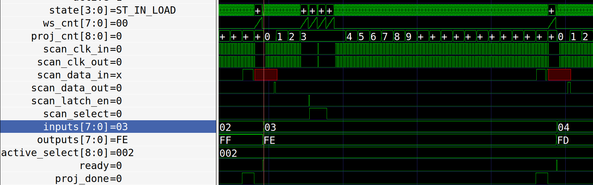

# Technical info

## Scan chain

All 498 designs are joined together in a long chain similiar to JTAG. We provide the inputs and outputs of that chain (see pinout below) externally, to the Caravel logic analyser, and to an internal scan chain driver.

The default is to use an external driver, this is in case anything goes wrong with the Caravel logic analyser or the internal driver.

The scan chain is identical for each little project, and you can [read it here](https://github.com/mattvenn/wokwi-verilog-gds-test/blob/main/template/scan_wrapper.v).

### Updating inputs and outputs of a specified design

A good way to see how this works is to read the FSM in the [scan controller](verilog/rtl/scan_controller/scan_controller.v).
You can also run one of the simple tests and check the waveforms. See how in the [scan chain verification](verification.md) doc.

Assuming you want to update project at position 2 (0 indexed) with lowest 3 inputs high and fetch the output.
Signal names are from the perspective of the scan chain driver.

* Set scan_select low so that the data is clocked into the scan flops (rather than from the design)
* Toggle scan_clk_out 16 times to skip project 0 & 1
* For the next 8 clocks, set scan_data_out to 0, 0, 0, 0, 0, 0, 1, 1
* Toggle scan_latch_en to deliver the data from the scan chain to the project
* Set scan_select high to set the scan flop's input to be from the project
* Toggle the scan_clk_out to capture the project data into the scan chain
* Toggle the scan_clk_out another 8 x number of remaining designs to receive the data at scan_data_in

## Clocking

Assuming:

* 100MHz input clock
* 8 ins & 8 outs
* 2 clock cycles to push one bit through the scan chain (scan clock is half input clock rate)
* 500 designs
* scan controller can do a read/write cycle in one refresh

So the max refresh rate is 100MHz / (8 * 2 * 500) = 12500Hz.

## Clock divider

A rising edge on the set_clk_div input will capture what is set on the input pins and use this as a divider for an internal slow clock that can be provided to the first input bit.

The slow clock is only enabled if the set_clk_div is set, and the resulting clock is connected to input0 and also output on the slow_clk pin.

The slow clock is synced with the scan rate. A divider of 0 mean it toggles the input0 every scan. Divider of 1 toggles it every 2 cycles.
So the resultant slow clock frequency is scan_rate / (2 * (N+1)).

See the test_clock_div test in the [scan chain verification](verification.md).

## Wait states

This dictates how many wait cycle we insert in various state
of the load process. We have a sane default, but also allow
override externally.

To override, set the wait amount on the inputs, set the driver_sel inputs both high, and then reset the chip.

See the test_wait_state test in the [scan chain verification](verification.md).

## Pinout

    PIN     NAME                DESCRIPTION
    20:12   active_select       9 bit input to set which design is active
    28:21   inputs              8 inputs
    36:29   outputs             8 outputs
    37      ready               goes high for one cycle everytime the scanchain is refreshed
    10      slow_clk            slow clock from internal clock divider
    11      set_clk_div         enable clock divider
    9:8     driver_sel          which scan chain driver: 00 = external, 01 = logic analyzer, 1x = internal

    21      ext_scan_clk_out    for external driver, clk input
    22      ext_scan_data_out   data input
    23      ext_scan_select     scan select
    24      ext_scan_latch_en   latch
    29      ext_scan_clk_in     clk output from end of chain
    30      ext_scan_data_in    data output from end of chain

## Instructions to build GDS

To run the tool locally or have a fork's GitHub action work, you need the GH_USERNAME and GH_TOKEN set in your environment.

GH_USERNAME should be set to your GitHub username.

To generate your GH_TOKEN go to https://github.com/settings/tokens/new . You don't need to tick any boxes in the form, the default is fine.

To run locally, make a file like this:

    export GH_USERNAME=<username>
    export GH_TOKEN=<token>

And then source it before running the tool.

### Fetch all the projects

This goes through all the projects in project_urls.py, and fetches the latest artifact zip from GitHub. It takes the verilog, the GL verilog, and the GDS and copies 
them to the correct place.

    ./configure.py --update-projects

### Configure Caravel

Caravel needs the list of macros, how power is connected, instantiation of all the projects etc. This command builds these configs and also makes the README.md index.

    ./configure.py --update-caravel

### Build the GDS

To build the GDS and run the simulations, you will need to install the Sky130 PDK and OpenLane tool.
It takes about 5 minutes and needs about 3GB of disk space.

    export PDK_ROOT=<some dir>/pdk
    export OPENLANE_ROOT=<some dir>/openlane
    cd <the root of this repo>
    make setup 

Then to create the GDS:

    make user_project_wrapper

## Verification

See the separate [verification](verification.md) doc.
