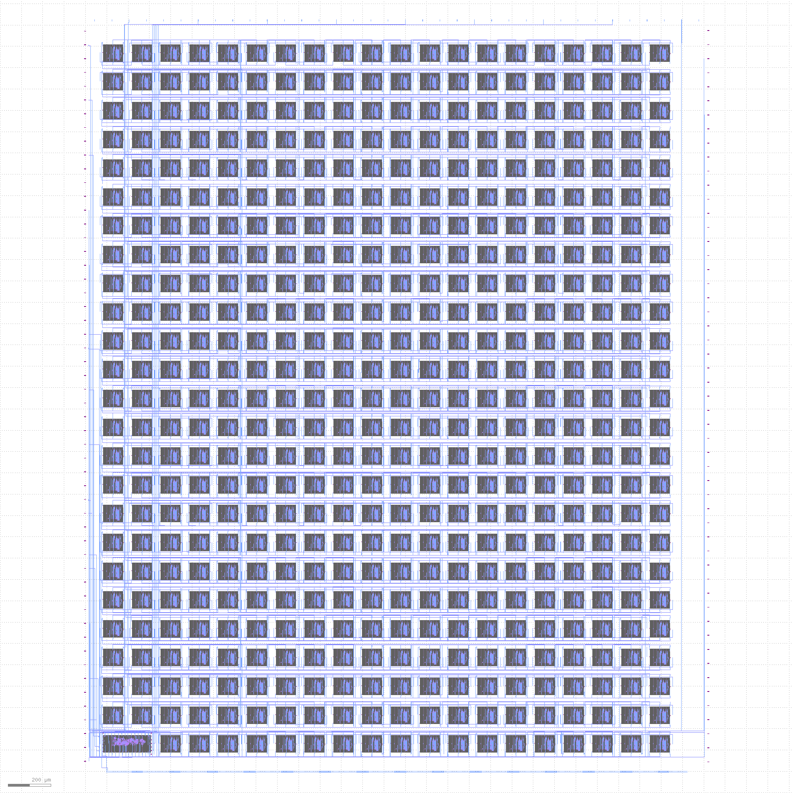

# TinyTapeout

* See https://tinytapeout.com for more information on the project and how to get involved.
* See [INFO](INFO.md) for how the project is built and technical project notes.

# GDS layout of all projects

# Project Index

* [339501025136214612](https://wokwi.com/projects/339501025136214612) https://github.com/mattvenn/tinytapeout-test-straight
* [340805072482992722](https://wokwi.com/projects/340805072482992722) https://github.com/mattvenn/tinytapeout-7seg-seconds-counter
* [341535056611770964](https://wokwi.com/projects/341535056611770964) https://github.com/mattvenn/tinytapeout-test-invert
